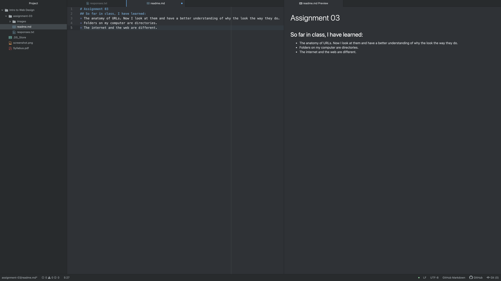

# Assignment 03
## Victoria Averill
### So far in class, I have learned:
* The anatomy of URLs. Now I look at them and have a better understanding of why the look the way they do.
* Folders on my computer are directories.
* The internet and the web are different.

[Moodle](https://moodle.umt.edu)

[My Responses](./responses.txt)

