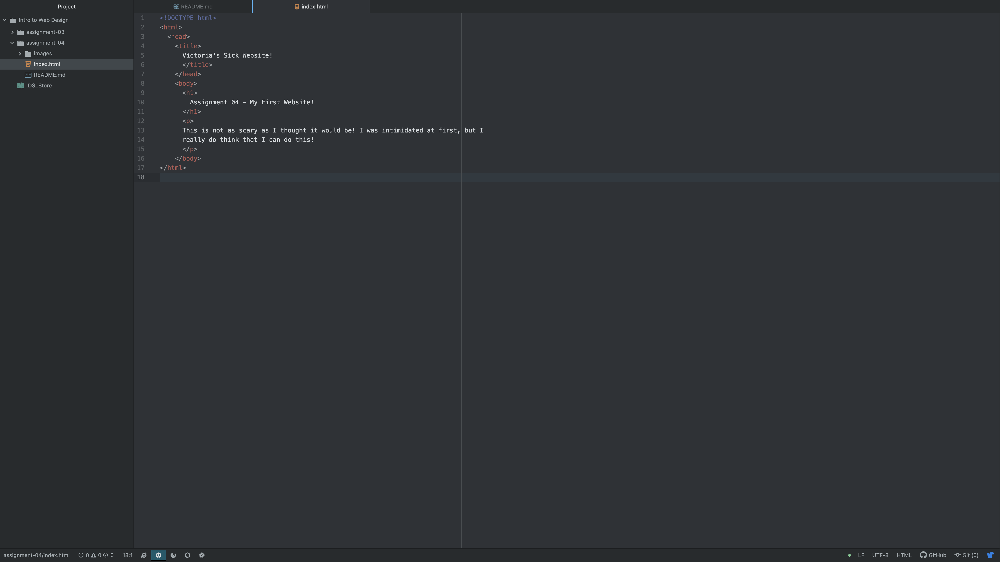

1. A web browser is a tool used to access the internet. They function by web languages are used to write out instructions that browsers translate and then render into all of the components of the website that users see and utilize. I use Safari and Google Chrome at home, but I also utilize Microsoft Edge at work. It is very interesting how they all are a little different.

2. 
