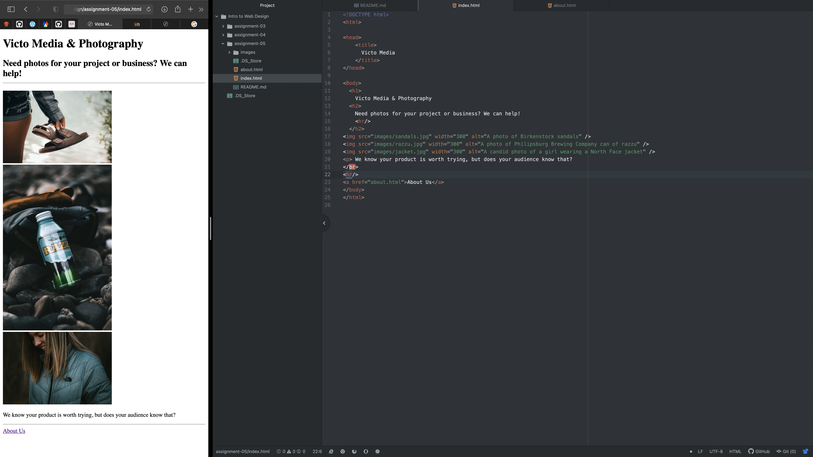

1. Using The Wayback Machine, I decided to visit Wendys.com because they are a company that has excelled in marketing and rebranding over the last few years so I was curious. I went back to 2005 for good measure and the older version was very different. The older version was nostalgic with the old logo, but overall it just looks very elementary. The menu is easy to navigate and find as it is right across the top. However, when I opened the "about us" section, there were even more hyperlinks. It was organized, but it seemed like a menu to get to another menu and in today's day and age there usually is a menu once you hover over each menu option to open up more pages to go to. I feel like it is not as organized and efficient as what I am used to today. The content in the website is also condensed into a small square and is not made to fit my larger screen. The new version is user friendly and has a minimalistic feel while still remaining clean. The design is friendly and not only does today's version have a search bar, but it also has two rows of menus which I found interesting and organized. It also has full pages where you can scroll and I like how full of content it is because the scrolling keeps the user interacting rather than just clicking a page and staring at it.

2. 
