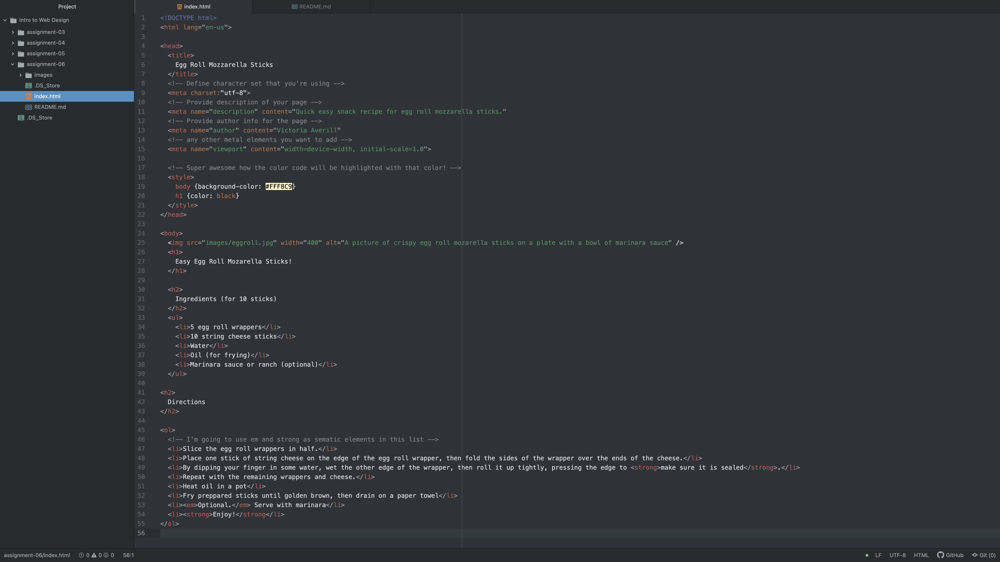

Semantic markup is use of HTML markup to reinforce the meaning of information on your webpage. They can emphasis words, put quotations, or links into your website for better navigation. Structural markup however is use to embed information about the structure of a document such as the headings, paragraphs, breaks, etc.

