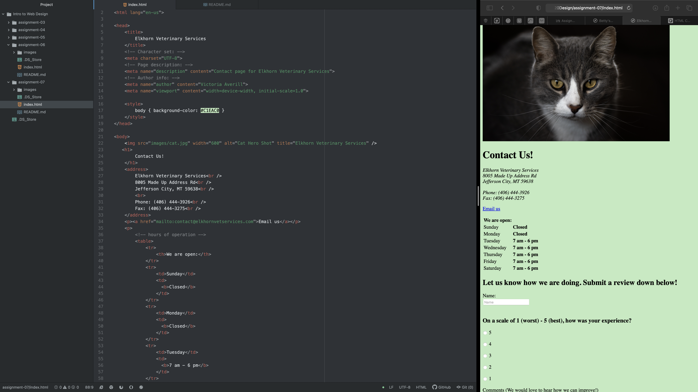

I typically come across text forms for things like email addresses, or names. Usually when I am looking at websites, I look at online stores and buy things so I come across forms for my mailing information as well as payment information fields. I also come across radio buttons and dropdown menus often. I come across these especially for surveys. I think surveys often hav buttons and dropdown menus to take up less of the user's time. That way, more people are willing to participate because they do not have to develop their input completely from scratch. I had no idea how many different types of forms there are!

