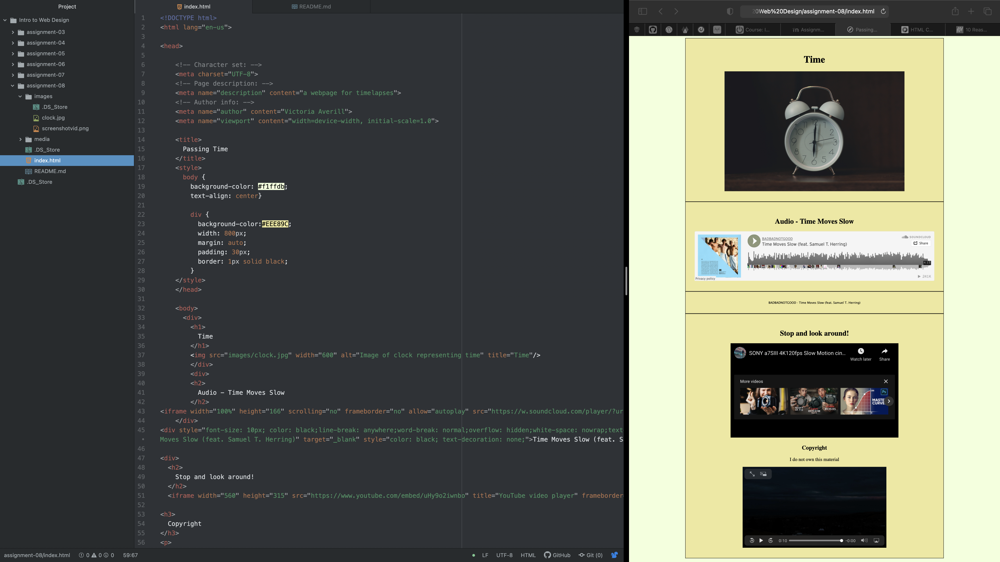

Affordance describes the relationship between a person and an object. That object can be either physical or digital and the relationship can often involve interactivity.

Third-party services help allow quicker loading time and also gives you more storage space on your device since you are not directly storing your video on your desktop in order for your video to work on your site. These services can host large, high quality versions of files efficiently. However, images are not ideal and unlicensed materials can be reported. These sources can also become costly unfortunately. Self-hosting however is ideal for image files and it keeps your content with you. It provides easy access to content but is not ideal for video or audio files. It also quickly takes up space on your device and can slow down your site.

This week, I faced the challenge of styling. It is very tedious but I stopped and took a breathe and played with things while refreshing my page until I saw things lay out how I wanted them.

