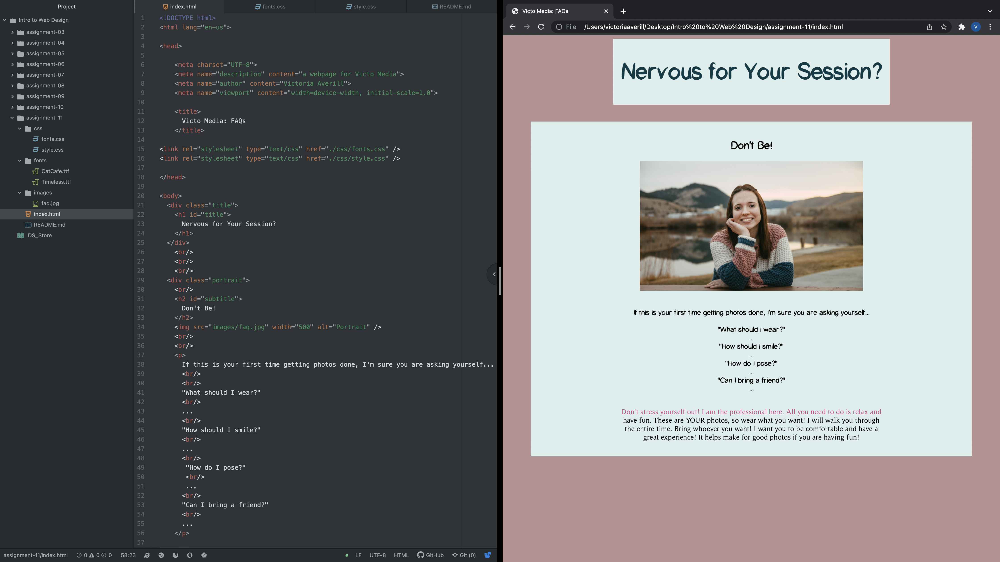

1. Typography is the technique of arranging type in a way that is functional, legible, as well as pleasant to the eye when it is displayed. Line length, font size, spacing, and many more components are considered by those who are practicing typography.

2. Fall back fonts or font stacks are important because not all browsers support the same fonts. If a computer does not have a font matching name, it will then try several fonts until it displays a 'serif' font by default. Fall back fonts and font stacks give the computer a list of options to use that are still pleasant to look at and different than the basic default font.

3. A system font is a font that is already installed on a computer. A web font is a font that usually is on a web server and can be downloader by a browser. These are especially created for websites. A Web-safe font is a font that is able to adapt to any browser on any kind of computer or devise. These will always be displayed even without being installed on the user's computer.

