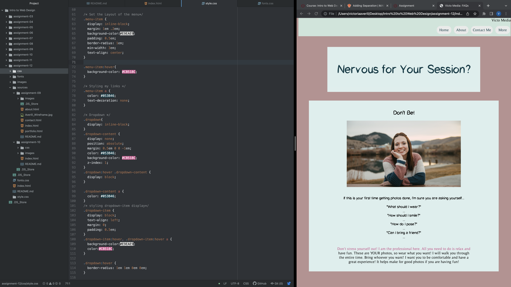

Boarders, similar to padding and margins define the amount of space an element can take up as well as its relationship to other boxes around it. Borders can be colored individually and have many different styling options. Borders are more of a cosmetic styling tool. Margins and properties are used more for space management.
Padding does just as it sounds it might. Padding refers to the amount of space that sits between the content of the element and the surrounding area of it.
Margins are the space between one element and another. They are used to add separation and accept both absolute and relative size units as well as padding.

This week's assignment was a little trickier. I can see how there are so many moving parts to a website, and I think this week I learned how important staying organized is!

