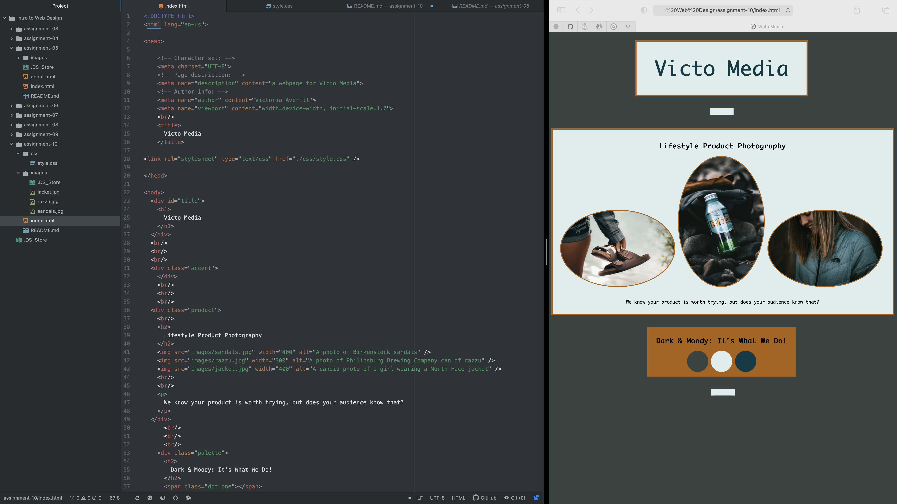

Universal selector types are just that: universal. They apply to everything and are very general. This would be useful if you are wanted to change the background color or font of your entire page. Element selector topes are applied to one element. An example would be changing the color of a the paragraph element. This would change it for the all paragraphs on your site as the paragraph is the element being changes. Class selectors are used to select elements that serve the same function such as divs. You can then change them on a less general scale. Lastly, ID selectors allow developers to define style rules for on individual element by providing it its own unique identification. This way developers can change one thing individually on the page like a sentence, title, or shape.

For my color palette, I wanted to use the colors that I often use in my photography. I wanted the website to complement my photos, and so I went with more neutral tones with the light blue and the darker blue/gray pulled from my images. I also wanted to use the orange in the center photo to add a nice contrast. I wanted to use that as more of an accent so it was less aggressive. Since all of the photos are outdoors, I wanted to use the earthier colors.

This week, I actually had a more enjoyable experience than normal. The style elements actually made a lot of sense for me and I felt like I could read my code a little better. This made it easier for me to play around with it. I would say the trial and error of putting things where I want them and adjusting the width and height and little things like that can be tedious as well as adding the correct amount of  's.

